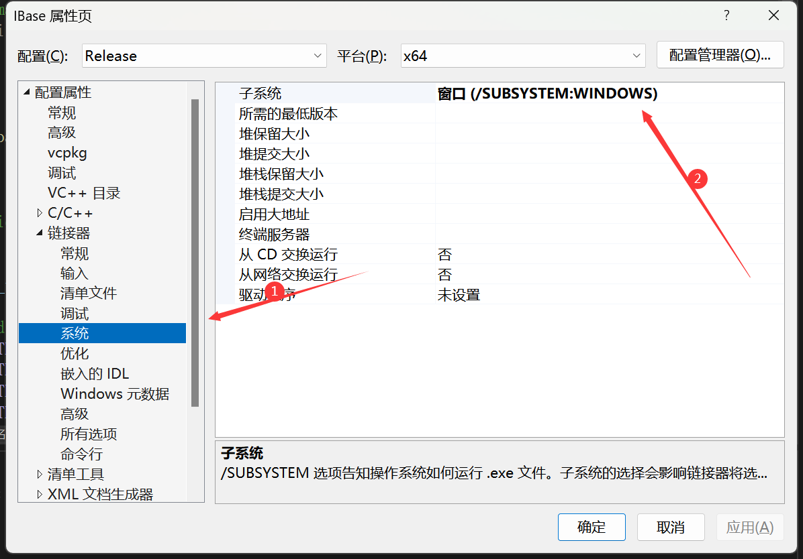
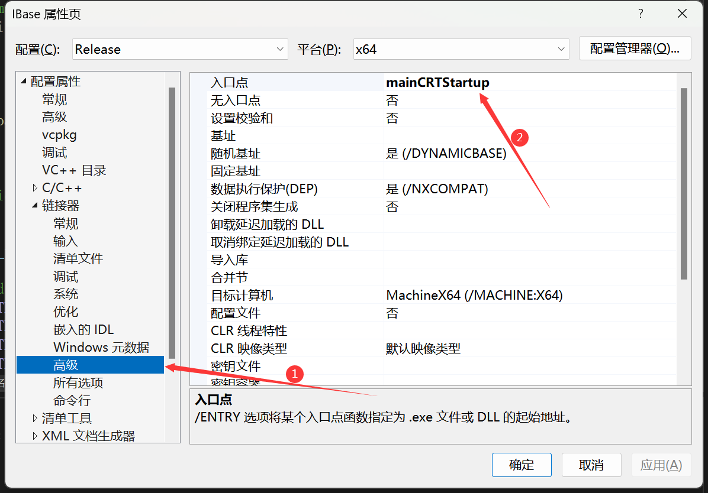
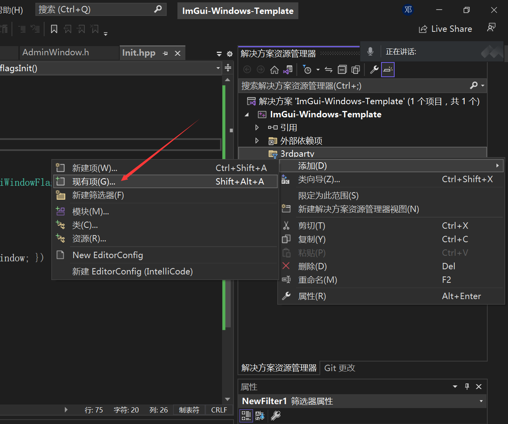
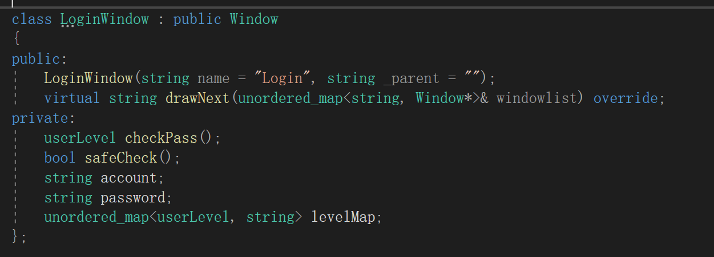
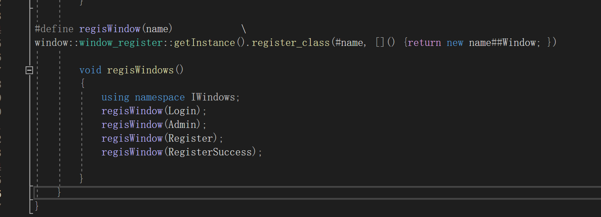
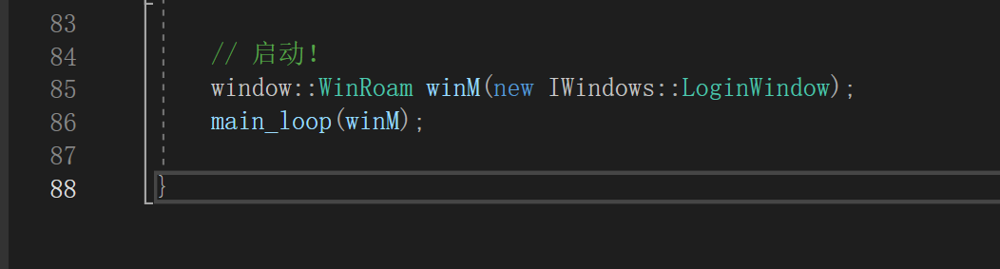

# ImGui-Window-Template

​	ImGui的窗口程序模板。

## 1. 项目设置

### 1.1 头文件

```
../3rdparty/include
../3rdparty/include/GLEW
../3rdparty/include/GLFW
../3rdparty/include/ImGui
../3rdparty/include/Jsoncpp
../3rdparty/include/Mysql
../3rdparty/include/MysqlConn
../3rdparty/include/Singleton
../3rdparty/include/WinRoaming
../3rdparty/include/stb
```

### 1.2 窗口设置

#### 1.2.1 项目属性

​	`项目——属性——链接器——系统——子系统`设置为**窗口**。



​	`项目——属性——链接器——高级——入口点`设置为`mainCRTStartup`



#### 1.2.2 链接器宏

​	在`main`函数前添加宏（本项目已添加于`Init.hpp`中）：

```C++
#pragma comment(linker, "/subsystem:windows")
```

### 1.3 lib链接

​	添加lib链接（通过代码方式添加在`Init.hpp`中）：

```C++
#pragma comment(lib, "../3rdparty/lib/glew32.lib")
#pragma comment(lib, "../3rdparty/lib/glfw3.lib")
#pragma comment(lib, "../3rdparty/lib/jsoncpp.lib")
#pragma comment(lib, "../3rdparty/lib/libmysql.lib")
#pragma comment(lib, "Opengl32.lib")
```

### 1.4 添加cpp




## 2. 创建Window

### 2.1 创建类

​	仿照LoginWindow格式，创建新的Window：



* 构造函数附带`name`和`parentname`，并传递给父类构造函数
* 必须有drawNext函数，返回值为下一个窗口的name

### 2.2 注册类

​	为了实现对创建的Window类的静态反射，需要手动添加注册代码在`Init.hpp`的`regisWindows`中：



​	下面是注册宏：

```C++
#define regisWindow(name)            \
window::window_register::getInstance().register_class(#name, []() {return new name##Window; })
```

## 3. 入口Window

​	在main.cpp的最后创建入口Window和WinRoam类，并添加进入主循环：

